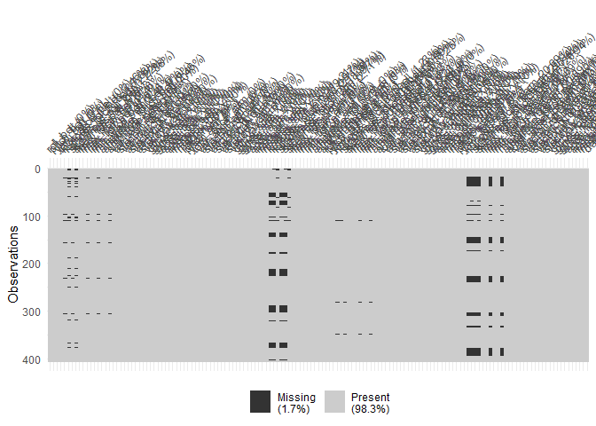
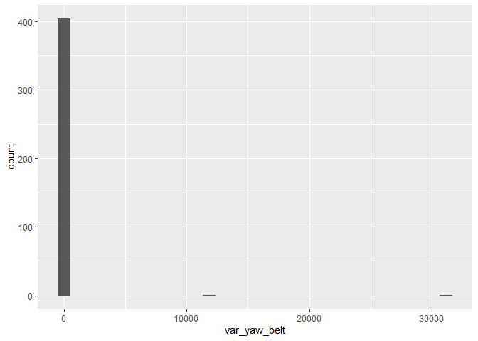

Predicting Users’ Barbell Lift Technique
================
Charles Bryan
11/7/2019

  - [Synopsis](#synopsis)
  - [Setup](#setup)
  - [Data Retrieval](#data-retrieval)
  - [Data Cleaning and Exploratory
    Analysis](#data-cleaning-and-exploratory-analysis)
  - [Modeling](#modeling)
  - [Conclusions](#conclusions)

## Synopsis

The task here is to determine how barbell lifts were performed based on
measurements taken from the participants doing the exercise. The barbell
lifts were performed in 5 different ways by different participants where
4 of the ways were incorrect in some common manner. After looking at the
provided training data it is apparent that many columns are left empty
or NA, so the training data is split into two separate sets: one set
with almost all columns containing data and one set with most columns
containing NA or no data. Next the data is cleaned and random forests is
run on the two sets. Both training models perform perfectly on their own
training sets, however, they differ on the provided test set. The model
trained on the larger training set performed perfectly on the provided
test set, while the second model only gets 75% correct. This is likely
because the large difference in observations used to train each model:
19216 for model 1 and only 406 for model 2.

## Setup

``` r
require(tidyverse)
require(caret)
require(gridExtra)
require(naniar)
require(DMwR)
```

``` r
set.seed(123) 
# sessionInfo()
```

<br>

-----

## Data Retrieval

First the training and test data provided below is imported:
<http://web.archive.org/web/20161224072740/http:/groupware.les.inf.puc-rio.br/har>

**Citation:** Ugulino, W.; Cardador, D.; Vega, K.; Velloso, E.; Milidiu,
R.; Fuks, H. Wearable Computing: Accelerometers’ Data Classification of
Body Postures and Movements. Proceedings of 21st Brazilian Symposium on
Artificial Intelligence. Advances in Artificial Intelligence - SBIA
2012. In: Lecture Notes in Computer Science. , pp. 52-61. Curitiba, PR:
Springer Berlin / Heidelberg, 2012. ISBN 978-3-642-34458-9. DOI:
10.1007/978-3-642-34459-6\_6.

``` r
if(!file.exists("./data")){dir.create("./data")}

# Weight Lifting Exercise Dataset (Separated into training and testing sets)
dataTrainUrl <- "https://d396qusza40orc.cloudfront.net/predmachlearn/pml-training.csv"
TrainfileName <- "./data/WeightliftTraining.csv"
if(!file.exists(TrainfileName)){download.file(dataTrainUrl, destfile=TrainfileName)}

dataTestUrl <- "https://d396qusza40orc.cloudfront.net/predmachlearn/pml-testing.csv"
TestfileName <- "./data/WeightliftTesting.csv"
if(!file.exists(TestfileName)){download.file(dataTestUrl, destfile=TestfileName)}

training_raw <- read.csv(TrainfileName)
testing_raw <- read.csv(TestfileName)
```

<br>

-----

## Data Cleaning and Exploratory Analysis

<br>

The test data provided is not time sequential, as in multiple
observations can not be used together to predict the exercise method.
Based on this, no time related columns are going to be helpful.
Therefore, these columns are removed from both the training and testing
sets.

``` r
training_sub <- subset(training_raw,select=-c(X, user_name,raw_timestamp_part_1,
                                              raw_timestamp_part_2,
                                              cvtd_timestamp, new_window,
                                              num_window))
testing_sub <- subset(testing_raw, select=-c(X, user_name,raw_timestamp_part_1,
                                             raw_timestamp_part_2, 
                                             cvtd_timestamp, new_window,
                                             num_window))
```

<br>

``` r
training_temp <- data.frame(lapply(training_sub, function(x) {gsub("^$", NA, x)}))
vis_miss(training_temp, warn_large_data = FALSE)
```

<!-- -->

<br>

This data set has a few different types of errors: Occurrences of "“,
NA, and DIV/0. In total there are 19622 observations. Exactly 19216 of
these rows have either”" or NA in many of the cells while the remaining
406 observations have DIV/0 errors in some of their cells. It appears
that for these 406 rows additional information was calculated and the
method used to calculate some values gave a DIV/0 error in those cases.

``` r
na_rows <- apply(training_temp, 1, function(r) any(r %in% c(NA)))

classeCount <- training_temp %>% group_by(classe) %>% summarise(no_rows = length(classe))
classeCountNoNA <- training_temp[!na_rows,] %>% 
  group_by(classe) %>%summarise(no_rows=length(classe))

classeCountNoNA$no_rows/classeCount$no_rows
```

    ## [1] 0.01953405 0.02080590 0.02045587 0.02145522 0.02190186

Interestingly each of the 5 classes is impacted by the NA errors
relatively similarly. If one class was more significantly impacted we
would need to take that into account.

We will divide the dataset up into two sets, the 406 rows with this
additional info (training\_sub\_div) and the 19216 rows that do not
(training\_sub\_na). This is done in case these additional features
prove to be useful in classifying the exercises.

``` r
training_sub_na <- training_temp[na_rows,]
training_sub_div <- training_temp[!na_rows,]
```

<br>

Now to clean up the data some:

  - Filter out columns that only have 1 value since this information is
    not helpful in classification.
  - Convert all columns other than the classe label into numeric
    variables.
  - In the training\_sub\_div dataset, convert the “DIV/0\!” error into
    NA to more easily work with.

<!-- end list -->

``` r
# Update Factor Levels based on the current dataframe, not the original
training_sub_na[] <- lapply(training_sub_na, function(x) if(is.factor(x)) factor(x) else x)
# Remove Columns with only 1 Factor level. These columns will not contribute to a model.
training_sub_na <- training_sub_na[, sapply(training_sub_na, function(col) length(unique(col))) > 1]
# Convert all columns to type numeric except the classe label
names_na <- colnames(training_sub_na)
names_na <- names_na[!names_na %in% c("classe")]
training_sub_na[names_na] <- lapply(training_sub_na[names_na], 
                                           function(x) as.numeric(levels(x))[x])

# Replace DIV/0 error with NA
training_sub_div <- data.frame(lapply(training_sub_div, function(x) {gsub("#DIV/0!", NA, x)}))
# Update Factor Levels based on the current dataframe, not the original
training_sub_div[] <- lapply(training_sub_div, function(x) if(is.factor(x)) factor(x) else x)
# Remove Columns with only 1 Factor level. These columns will not contribute to a model.
training_sub_div <- training_sub_div[, sapply(training_sub_div, function(col){
  length(levels(col))}) > 1]
```

<br>

Some values in the training\_sub\_div dataset are still missing as shown
below:

``` r
vis_miss(training_sub_div, warn_large_data = FALSE)
```

<!-- -->

<br>

These rows with missing data make up a significant portion of the 406
observations in this set, so idealy they would not be removed. These
missing values are numeric, so imputing the values using default knn is
appropriate.

``` r
training_sub_div_clean <- knnImputation(training_sub_div, k = 10, scale = T, 
                                        meth = "weighAvg", distData = training_sub_div)
```

<br>

As before, the dataset is cleaned of any columns that have only one
value and also all features are converted to numeric other than the
classe labels.

``` r
# Convert all but the classe label from Factor to numeric
names_div <- colnames(training_sub_div_clean)
names_div <- names_div[!names_div %in% c("classe")]
training_sub_div_clean[names_div] <- lapply(training_sub_div_clean[names_div], 
                                            function(x) as.numeric(levels(x))[x])

# Remove Columns with only 1 Numeric value. This ends up only being the column
# "amplitude_yaw_dumbbell" with only the value 0
training_sub_div_clean <- training_sub_div_clean[, sapply(training_sub_div_clean, function(col){length(unique(col))}) > 1]
```

<br>

I used the following method to plot histograms of each variable to
visually find any outliers. Unfortunately due to the amount of features
the plot does not fit well in one viewing.

``` r
 training_sub_div_clean %>%
  keep(is.numeric) %>%
  gather() %>%
  ggplot(aes(value)) +
    facet_wrap(~ key, scales = "free") +
    geom_histogram()
```

<br>

Rather than showing all of the feature plots, below is one such
histogram. The plot has almost all points clustered to the far right
with just a couple points far to the right. Therefore this feature
should be further investigated for outliers. It turns out for this
feature almost all of the data is beneath the value 60 with a couple of
extremely high outliers in the tens of
thousands.

``` r
ggplot(data=training_sub_div_clean, aes(x=var_yaw_belt)) + geom_histogram()
```

    ## `stat_bin()` using `bins = 30`. Pick better value with `binwidth`.

<!-- -->

<br>

Based on the plots and further inspecting the data, some outliers of
each dataset are filtered using the following criteria:

``` r
training_na_filter <- training_sub_na %>%
  filter(magnet_belt_x < 350) %>%
  filter(magnet_belt_z < 100) %>%
  filter(gyros_forearm_z > -6) %>%
  filter(gyros_dumbbell_x > -100) %>%
  filter(magnet_dumbbell_y > -2000)
```

``` r
training_div_filter <- training_sub_div_clean %>%
  filter(amplitude_roll_belt < 300) %>%
  filter(kurtosis_picth_arm < 15) %>%
  filter(kurtosis_picth_dumbbell < 40) %>%
  filter(kurtosis_roll_arm < 15) %>%
  filter(kurtosis_roll_belt < 30) %>%
  filter(kurtosis_roll_dumbbell < 40) %>%
  filter(kurtosis_roll_forearm < 30) %>%
  filter(magnet_belt_x < 350) %>%
  filter(magnet_belt_z < 100) %>%
  filter(max_yaw_belt < 30) %>%
  filter(max_yaw_dumbbell < 40) %>%
  filter(max_yaw_forearm < 40) %>%
  filter(min_yaw_dumbbell < 40) %>%
  filter(min_yaw_forearm < 30) %>%
  filter(stddev_roll_arm < 150) %>%
  filter(stddev_yaw_belt < 80) %>%
  filter(var_accel_dumbbell < 100) %>%
  filter(var_pitch_dumbbell < 6000) %>%
  filter(var_roll_arm < 20000) %>%
  filter(var_yaw_arm < 15000) %>%
  filter(var_yaw_belt < 60) %>%
  filter(var_yaw_dumbbell < 7000) %>%
  filter(gyros_forearm_z > -6) %>%
  filter(gyros_dumbbell_x > -100) %>%
  filter(magnet_dumbbell_y > -2000)
```

<br>

-----

## Modeling

<br>

While it was not taken into account during the data cleaning, the
testing set has many rows that are entirely NA. This makes them unusable
for classification. First the usable columns in the testing set are
determined.

``` r
testing_columns <- colnames(testing_sub[1,!sapply(testing_sub, function(x)all(is.na(x)))])
length(testing_columns)
```

    ## [1] 53

Only 53 of the original columns are actually usable.

<br>

Two models are built using using random forests and 10-fold cross
validation.

modFit1 will be using the large dataset of 19216 observations which
removed all of the features that contained NAs. The model is only
trained with the columns shared between this set and the testing set.

``` r
training_na_columns <- colnames(training_na_filter)
training_na_intersection <- intersect(testing_columns, training_na_columns)

#Setup our cross validation. We will use this in model2 as well
train_control<- trainControl(method="cv", number=10)

modFit1 <- train(classe~., 
                 data=training_na_filter[,c(training_na_intersection, "classe")],
                 trControl=train_control,
                 method="rf")

training_predict1 <- predict(modFit1)
sum(training_predict1 == training_na_filter[,"classe"])/length(training_predict1)
```

    ## [1] 1

This model had a perfect accuracy on its training set of 19216
observations with a very low OOB estimate of error rate of 0.44%.

<br>

``` r
modFit1$finalModel$confusion
```

    ##      A    B    C    D    E  class.error
    ## A 5467    1    0    0    0 0.0001828822
    ## B   12 3702    3    0    0 0.0040355125
    ## C    0   22 3330    0    0 0.0065632458
    ## D    0    0   42 3103    2 0.0139815697
    ## E    0    0    0    4 3447 0.0011590843

<br>

Similarly modFit2 is built using the dataset of 406 observations and
10-fold cross validation. This dataset has the additional columns that
were not present for the 19216 observations above. However, the model
can only be trained on features shared between this dataset and the
testing set.

``` r
training_div_columns <- colnames(training_div_filter)
training_div_intersection <- intersect(testing_columns, training_div_columns)

modFit2 <- train(classe~., 
                 data=training_div_filter[,c(training_div_intersection, "classe")],
                 trControl=train_control,
                 method="rf")

training_predict2 <- predict(modFit2)
sum(training_predict2 == training_div_filter[,"classe"])/length(training_predict2)
```

    ## [1] 1

This model had a perfect accuracy on its training set of 406
observations, however, it has a high OOB estimate of error rate: 21.04%.

<br>

``` r
modFit2$finalModel$confusion
```

    ##    A  B  C  D  E class.error
    ## A 89  5  2  5  0   0.1188119
    ## B  7 51  9  4  1   0.2916667
    ## C  5  1 61  2  1   0.1285714
    ## D  3  4 10 47  2   0.2878788
    ## E  1 11  5  2 57   0.2500000

<br>

Each model is now run on the testing
set.

``` r
testing_predict1 <- predict(modFit1, newdata = testing_sub[,training_na_intersection])
testing_predict2 <- predict(modFit2, newdata = testing_sub[,training_div_intersection])
```

<br>

The results our two models’ predictions can be compared.

``` r
sum(testing_predict1==testing_predict2)/length(testing_predict1)
```

    ## [1] 0.75

It appears that the predictions were the same for only 75% of the
testing observations. For the 20 quiz questions I used the results from
the larger set as it was more reliable based on the model error
estimates and the sheer number of observations used for training. This
model received a perfect score on the limited test set provided.

<br>

-----

## Conclusions

1.  I would expect little error when using modFit1 based on the very low
    error estimate, however, I would expect a large error rate using the
    second model.
2.  Looking back at the steps I took for data cleaning, I should not
    have split the data based into a group of 19216 and 406
    observations. This was done thinking the extra features would be
    helpful in the dataset of 406, however, the test set did not contian
    the additional features provided by this set making them no more
    helpful.
